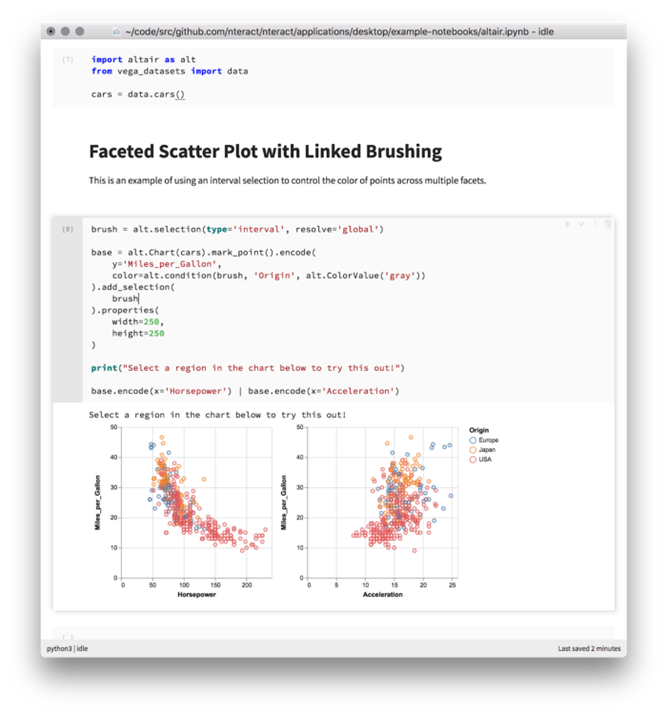
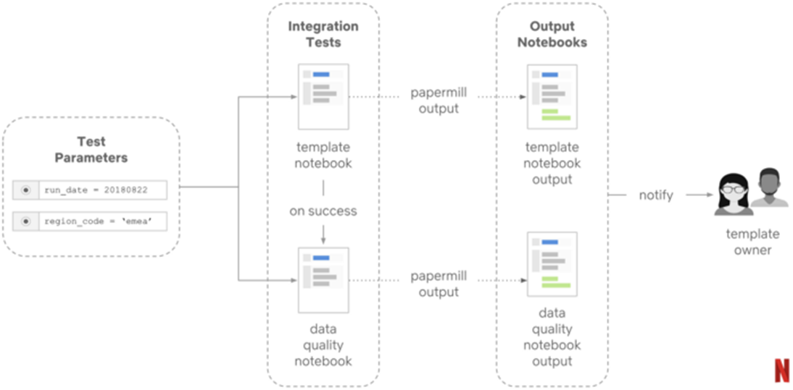
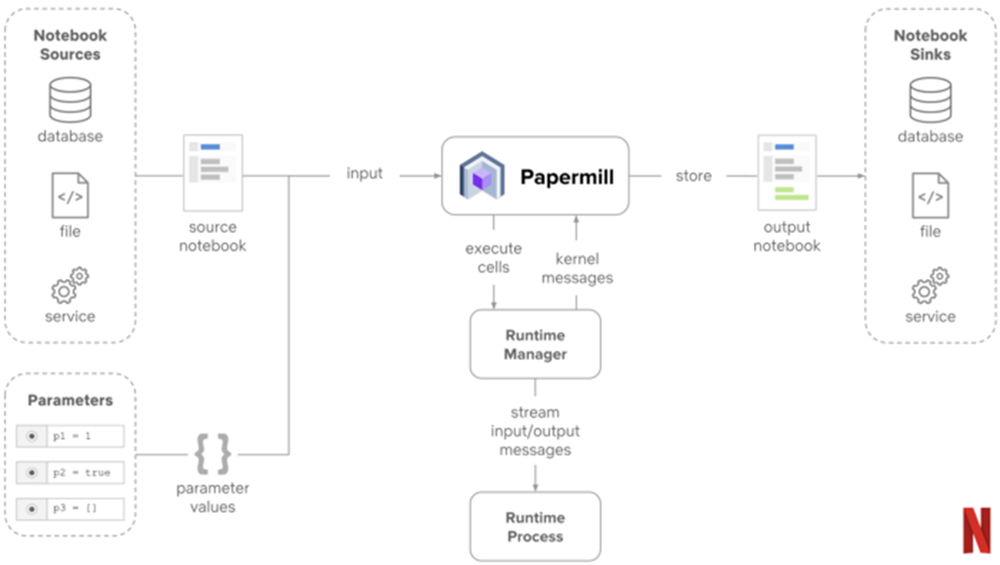
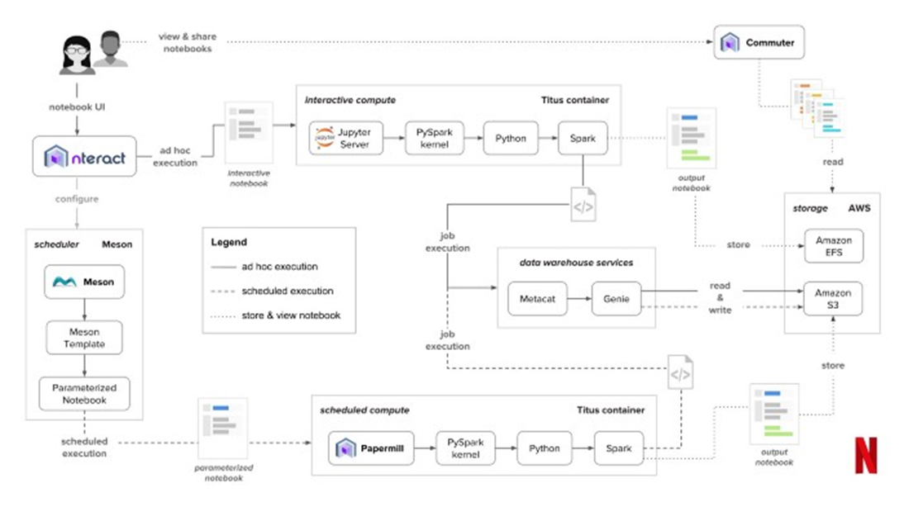

# JUPYTER NOTEBOOK

JUPYTER NOTEBOOK is an incredibly powerful and popular tool used by data analysts and scientist to interactively develop, analyze and present data.  
Its simple web based user interface helps us to visualize analytics, run machine learning models, and explore new possibilities.

OPTIMUS enhances the power of JUPYTER NOTEBOOKS for users from analysts to engineers by simplifying the integration of notebook analysis with the broader process of extracting and preparing data for analysis and exporting the results from notebooks to other processes.

## Capabilities

By leveraging and integrating [Papermill](https://www.wrighters.io/parameters-jupyter-notebooks-with-papermill/) - an opensource solution developed by NETFLIX - into the solution, OPTIMUS allows you to:

- Directly run one or multiple notebooks with different parameter values from the automation script.  This allows the user to create resusable parameterized JUPYTER NOTEBOOKS, in effect turning the notebooks into reusable data processing and automation functions.

    - [Using papermill parameters with Jupyter Notebook](https://papermill.readthedocs.io/en/latest/usage-parameterize.html) 

- The Jupyter notebooks can be written in various languages (Python, Scala, SparkSQL, and R).  You are also not limited by the installed libraries in OPTIMUS as you can setup your own virtual environments with additional python libraries and [use Jupyter with your own custom virtual environment](https://towardsdatascience.com/creating-and-using-virtual-environment-on-jupyter-notebook-with-python-db3f5afdd56a)

- Data can be shared between cells via temporary tables.  Or across notebooks and with the automation script through the use of [scrapbook](https://www.wrighters.io/building-jupyter-notebook-workflows-with-scrapbook/).

- Results from the notebook can be easily exported as Excel, csv or image files and used for further downstream automation, such as sharing on a cloud drive, generating a PDF document and/or sending a report to the user via email.

- And using OPTIMUS, multiple notebooks can be chained and scheduled in a workflow to accomplish complex automation and data transformation tasks.

Some examples of how NETFLIX has revolutonized the use and deployment of JUPYTER NOTEBOOKS for data analysis.

## Installing Jupyter Notebook

Jupyter Notebook and Papermill will be automatically installed with your OPTIMUS installation.  But should you wish to install your own instance, check out:  
[How to install Jupyter Notebook in Windows](https://www.geeksforgeeks.org/how-to-install-jupyter-notebook-in-windows/) 

## Getting Started 

Its assumed that you have already some working knowledge of tools like Pandas and matplotlib to fully utilize the power of Jupyter Notebook for data analysis.
Here are some useful guides to get started or to refresh your memory.

### Pandas

[Quick Start guide on Jupyter Notebook and using Pandas](https://github.com/jvns/pandas-cookbook)

[Pandas Cookbook from Py Data Org](https://pandas.pydata.org/docs/user_guide/cookbook.html)

### Styling Gallery

[Dataframe Styling using Pandas](https://mode.com/example-gallery/python_dataframe_styling/)

[Style Pandas dataframe like a master](https://towardsdatascience.com/style-pandas-dataframe-like-a-master-6b02bf6468b0)

### Matplotlib

[Matplotlib Intro from W3 schools](https://www.w3schools.com/python/matplotlib_intro.asp)
