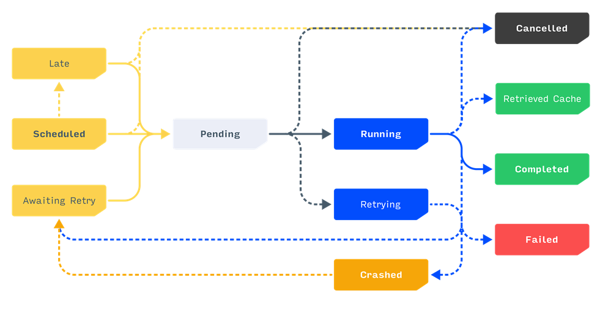
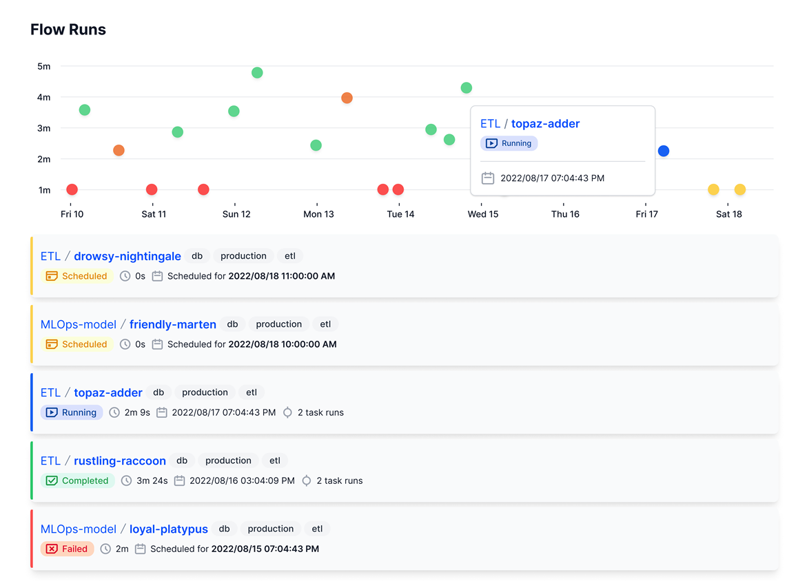

# ORCHESTRATION

OPTIMUS uses PREFECT to support powerful workflow and monitoring capabilities for automation flows.  
Examples of some of these features include

## Workflow dashboard

Clean modern dashboard to monitor status of all automation flows e.g. late runs, successfully completed runs, or failed runs.



Both manually triggered and scheduled unattended runs can be monitored from this single dashboard.  Unattended are distinguished from manual runs with the server/computer name on which the job is deployed to. E.g. cscKPI-XXX03 where cscKPI is the ***flow name*** of the automation script file and XXX03 is the ***computer or server name***




## Automation Run Logs

Detailed logs of all automation run steps can be viewed in the job details of the dashboard


## Scheduling of Automation Jobs

Automation jobs can be manually run from the command line.  Or deployed and scheduled in the workflow dashboard as an unattended run.  
Schedules are defined using [cron expressions](https://docs.prefect.io/concepts/schedules/)


## Unattended Deployments

All automation runs can be deployed to run unattended on a server or computer.  [View and manage deployments](https://docs.prefect.io/ui/deployments/) from the dashboard console.  

>
> To deploy a flow / script:  
> ```
> runrpa -f <flow/script name> -o 2
> ```  
> For list of available parameters:  
> ```
> runrpa -h
> ```  
>


