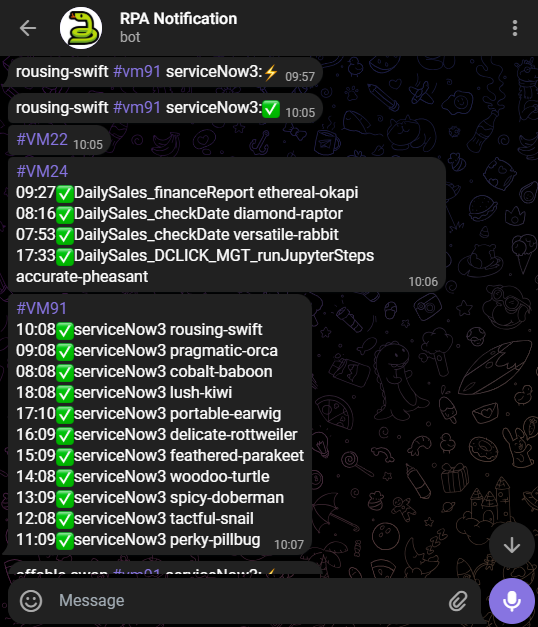
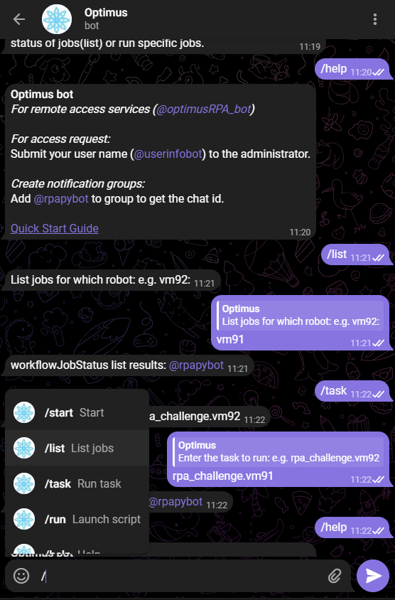

# TELEGRAM

OPTIMUS integrates with Telegram application to provide notification and remote bot services.  
Here are some things you can do with this integration:  

1. Telegram Notification

2. Remote Bot Services

## Telegram Notification

Sends a message via telegram to specified telegram user or chat id.  



Telegram notification bot is a service created by RPA Python / TagUI (Ken Soh).  
The bot can be accessed via Telegram mobile or web application from this link [https://t.me/rpapybot](https://t.me/rpapybot).  
Or by scanning the QR code - should launch the service in your web app or mobile app.


The service can be called from OPTIMUS via the keyword `telegram`.  
It takes 2 arguments - the `user id` or `chat id`, and the `message to send`.  
You can use this to send real-time notifications from your automation script to telegram:  

```
telegram: -4661161234 , This is a message from OPTIMUS
telegram: 1234567890 , Hello World. Olá Mundo. नमस्ते दुनिया. 안녕하세요 세계. 世界,你好。
telegram: 1234567890 , Use backslash n for new line\nThis is line 2 of the message
```
!!! note "Configuring your Telegram notification"
    From your OPTIMUS program launcher, you can configure whether to activate notifications or not, and which user id to receive notifications.  
    Click menu option: **SETTINGS > NOTIFICATIONS** or from the **SETTINGS > CONFIG FILE**:  
        - notifications.activate - True/False  
        - notifications.id - user id  

!!! note "Secure Temporary Storage"
    OPTIMUS leverages a function in TagUI to provide secure temporary storage and sharing of files:  
    ```
    telegram: 1234567890 , Access confidential report at {{@storageBin('secret_agent_report.pdf', 'optional password')}}
    ```

## Remote Bot Services

Optimus bot allows you to perform remote services with your OPTIMUS installation via telegram.  Some of the actions you can remotely perform are:  

1. `List` - to monitor automation jobs remotely.  Supports monitoring across multiple installations or instances of OPTIMUS robots if you set up the federation of robots accordingly on a common "message bus".

2. `Task` - to run automation tasks remotely.  As above, you need to setup the federation of robots with a common "message bus" if you wish to execute tasks across various robots.



To access your instance of Optimus RPA bot, you can click this link [https://t.me/optimusRPA_bot](https://t.me/optimusRPA_bot) or scan the following QR code:


!!! note "Configuring your remote services"
    From OPTIMUS program launcher - **SETTINGS > CONFIG FILE**  
    1. remote.robot_id - unique identifier for this installation or robot instance e.g. VM91  
    2. remote.tasks_token_dir_primary and secondary - path of directory that acts as common message bus for remote actions  
    3. telegram.valid_user - comma delimited list of user IDs in following formats @john or 1234567. Defines who can access the bot to run tasks and actions.  
    4. optimus.runTelegram - True / False.  There can only be one "master" robot with telegram agent/service activated in a federation of robots.  This is the robot that receives action commands from telegram and spreads its to other robots via the message bus.  
