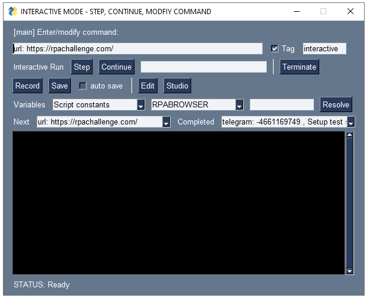
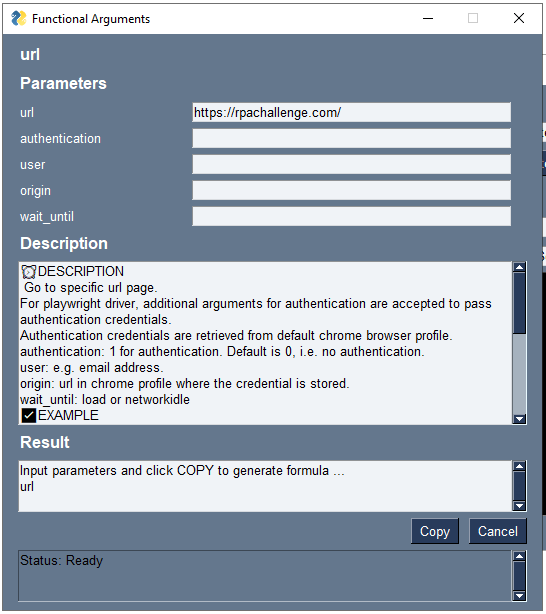
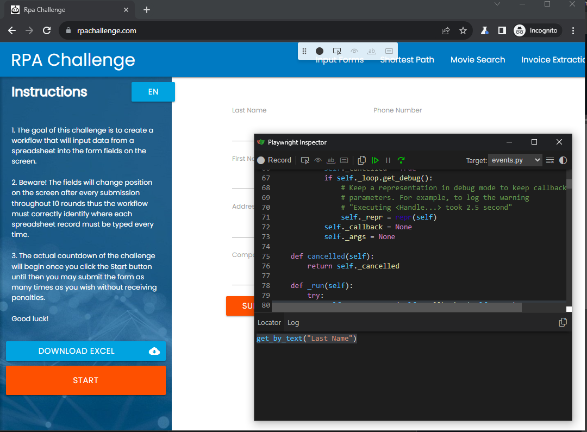
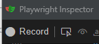

# Creating Automation Flows

Introduction to Basic concepts of creating your automation flows in Excel.  

## Basic Concepts 

Creating automation flows in OPTIMUS is as simple as writing a cooking recipe.  
And just like a cooking recipe, OPTIMUS scripts consist of a list of action steps.  These steps are defined in a table in Excel, which follows a specific structure that OPTIMUS is able to process.  

### Excel Script Structure  

Automation scripts require following header fields: `Type`, `Object`, `Key`, `Value` and `Comments`.  
You can refer to the screenshot below for an example OPTIMUS script that is used to complete the [RPA challenge](https://rpachallenge.com/) in under 10 seconds.  

Below is a description of the purpose of each of the header fields:   

1. **Type**  Used to define if an Object is an automation action step or a variable.  Typical values for `Type` include:  
    - **list** used to define objects that are automation actions.  
    - **key** and **table** are used to define variables or parameters used in the script.  `key` for key value pair objects.  And `table` for variables with column headers and values.  
    - **description** used for documentation of script. Ignored by OPTIMUS.  

    It is not neccessary to her define the `Type` value for every Object.  Required only when the `Type` is changed like the example below for RPA Challenge.

2. **Object**  Objects can be:  
    - automation action steps (must be of type `list`).  Many keywords are available to support various automation actions.  Keyword actions must be separated by semi colon e.g.  
    `telegram: -4661169749 , Setup test sample`  
    `telegram` is a keyword action used to send a telegram message.  This action takes 2 parameters.  First parameter is the telegram user or chat id (`-4661169749`).  And the second parameter `Setup test sample` is the message to send.  Note that each parameter must be separated by a space comma space ` , `.  
    - block or collection of action steps (must be of type `list`).  
    `main` is the special name for a block or collection of actions.  It is the name of the first block of action that OPTIMUS starts with by default.  In the example below, `main` action block consist of the following steps: `url: https://rpachallenge.com`, `download: ...`, `DF read file: ...` etc.  
    `fill form` is another example of a list or block of action steps.  
    - name of variables e.g. `key` value pairs, or `table` variables.  
    In the example below, `constants` are a special type of `key` variables.  And `input_map` is a type of `table` variable.  

3. **Key** and **Value** paris are used in conjunction with `key` variables e.g.  
    - `URL` could be the name of a user defined variable to contain various URL key value pairs. You could have a URL for `Google website`, `Yahoo website`, `LinkedIn website`.  The URL of each of these types of websites would be stored in the `Value` column.  And `Google website`, `Yahoo website`, `LinedIn website` would be defined in the `Key` column.  
    - `RPABROWSER` is a special variable in OPTIMUS (with Object name `constants`) to define what type of automation browser engine to use. `1` for Microsoft Playwright (default setting). `0` for TagUI (legacy support).  

4. **Comments** are not processed by OPTIMUS.  Used to annotate or document the step.  

### Keyword actions, Automation Steps and Libraries  

OPTIMUS provides many pre-built keyword actions and also extended keyword actions from user defined libraries and modules.  

1. **Core actions**  
    - for basic control of automation process e.g.  
    `iterate: challenge , fill form`  
    iterate or loop through every item in the table variable `challenge`.  And for each item or row in the table, perform the block of actions `fill form`.  
    `if: conditions , do this , else do that` is another common control flow action for if else condition logic.  
    `codeList: do this action block` is another common control flow used to call or process a list of actions steps.  These action steps can be defined as a comma delimited list e.g.  
    `codeList: step A, step B, step C`.  Note each step is separated by a comma.  But do not put a space before the comma, else it will be assumed by OPTIMUS you are defining multiple parameters.  
    - perform standard functions like  
    `print: If [Setup] is defined, the steps are run prior to any steps in "main"`  
    prints the given text to the screen console when OPTIMUS runs.  Mainly for describing or logging some results defined in the step.   

2. **User defined modules/libraries**  Here are some libraries provided by OPTIMUS:  
    - `Browser_playwright` contains keyword actions for automating browser using Microsoft Playwright e.g.  
    `click` a web page element identifier.   
    `type` some values into an input element identifier in the web page.  
    `locate: Period , iframe , click` is a commonly used action to locate an element identifier in the context of an iframe or page, and perform an action like click.    
    Many web page element identifiers can be described using the text description on the web page like 'Period' in the above example.  But for more complex cases that require precise identification, it is necessary to use XPATH syntax like //button[text()]="Start".  
    - `Browser_tagui` contains keyword actions for automating browser using TagUI automation engine.  Many of the keywords follow the same naming as in TagUI. So, you can refer to the very clear documentation on TagUI for description of these keywords.   
    - There are many other keywords available in the following libraries: `BuiltIn`, `DataFrame`, `Email_Exchange`, `Excel`, `FileSystem`, `Flows`, `Formulas`, `Github`, `Image`, `PDF`, `Prefect`, `Python`, `Table`, `Vault`, `Windows`.
    - All libraries are written in Python.  There is the `LibraryTemplate` library with some boiler plate code, which you can copy to write your own user defined libraries.  

As it can get quite complicated to remember all the available keywords, OPTIMUS RPA provides a `Studio` application to simplify the entry of keyword commands.  
`OPTIMUS RPA Studio` can also be used to help determine the web page element identifiers or selectors.   

### User defined constants, variables, tables

You can reference user defined constants, variables or tables using a curly brackets `{{variale name}}` or like `<variable name>`. 

1. `key` variables can be user defined. And the values can be returned like `{{Object:Key}}`
    - Using the example above for URL variables, you would return the value of the `Google website` variable using `{{URL:Google website}}`   

2. `constants` are a special type of `key` variables  
    - `RPABROWSER` is an example of a constants key variable that is used to define the type of automation browser engine to be used for web browser automation.  
    - and it can be referenced in the script like `{{RPABROWSER}}`.  
    `print: Value of {{RPABROWSER}}` will write `Value of 1` to the screen console if RPABROWSER is set with a value of 1.  
    - Other special system constants that can be called in the script using this syntax include:
    `{{iterationCount}}` which keeps track of the item / row count when iterating or looping through a table of values.  `iterationCount` starts with an initial value of 0.  
    `{{yesterdayYYYYMMDD}}` gives the value of yesterday in the format of YYYYMMDD.   

3. `table` variable values are referenced in the following way:
    - `{{table Object:Key}}` e.g. `{{Report:URL}}`.  Where table Object = table name, Key = Key column field value. 
    - Another example from the RPAChallenge script above would be `{{challenge:First Name}}`.  Which is basically returning the `First Name` in the `challenge` table object.  

4. `formulas` are special functions in OPTIMUS, similar to Excel formulas, where you can perform some calculation and return the corresponding value.  

??? info "Example:"

    - `<@filesRecent('{{file_name}}, {{last_x_hr}})>` checks if the given file name is recent i.e. within the last X hours.  
    - The name of the formula is filesRecent. It must be prefixed by `@` symbol to denote a formula.
    - And it take multiple arguments or parameters separated by comma. Syntax is similar to python function call e.g. function(argument 1, argument 2).  
    - Formula argument values can reference a variable value like `{{file name}}`.    
    - And you can create your own user defined formulas in the `Formulas` library.  

!!! info "Note:"  

    Variables are commonly used in an automation script to check a particular condition for processing.  
        - For example with the `if` command: `if: condition , do this , else do that`  
        - You can use variables in the following ways for the condition:    
        - `if: {{Reports:Run}} , do action 1 , do action 2` Simple case where you reference the `Run` Key in `Reports` table object, which if `TRUE` would `do action 1`.  

    For evaluaton of more complex conditions, you would need the following syntax:  
        - `if: "{{report_to_run}}" in "{{Reports:Title}}" , do action 1 , do action 2` Checks if `{{report_to_run}}` value is contained in the `{{Reports:Title}}`.  Note the use of double uotes `"  "` to denote that the value in `{{report_to_run}}` is of type String.
        - `if: "{{Reports:cell_value}}"=="nan" , do acton 1 , do action 2` Checks if the `{{Reports:cell_value}}` is blank or empty.  

    The last 2 examples of the condition above would be familar to Python developers, as its similar to the evaluaton of a Python expression.  

### More Advance Concepts for Excel Scripts

1. Typical Structure of Excel script:  
    - As shown in the RPA Challenge example, for good readability, it is common to structure the automation script with elements in the following sequence:
        - description
        - User defined constants
        - User defined variables
        - User defined tables
        - Special actions like **\[Setup\]** and **\[Teardown\]**
        - "main" block of actions
        - Additional user defined action blocks
    - But this sequence is not mandatory.  OPTIMUS will still be able to process your scripts if it is sequenced differently, as long as you apply the correct `Type` to denote each object. 
        
2. Special actions:
    - **\[Setup\]** - if \[Setup\] is defined, the steps are run prior to any steps in "main"  
    - **\[Teardown\]** - actions that are run after completion of other actions  

    It is not mandatory to have **\[Setup\]** and **\[Teardown\]** actions in your script.  It is useful if you want to apply some actions in your script at start up or when it ends regardless of the processing situation.  For example, **\[Teardown\]** would run even if the script fails in error during the middle of the process.  You can use this to send an alert message of the error which is captured in the `{{error}}` variable as in the RPA challenge example.  

## Using Templates

How to use and customize Excel templates for automation.  

1. Organizing large automation processes across multiple Excel files and worksheets:
    - Worksheets and Files can be used to organize large flows into smaller logical sections to promote reuse.  
    - To call the steps in another worksheet, use `runModule: worksheet name , name of action object`  
    - To call the steps in another file, use `runOptimus: .... `.  This launches a separate RPA flow run.  

## OPTIMUS RPA Studio

Application to help launch and edit scripts.  Also provides features like: recording, debugging, inspect browser locators.  

**Shortcut**:  

  

**Optimus RPA menu**:  

  
  
Using OPTIMUS RPA studio.  Typical steps:
- Select script
- Edit script
- Debug script
- Log - special beta logging
- Break - if word matches action
- Run script  

  
  
**Debug / Interactive Run mode**:  

  

**Record and Save**:  

  

- Record and Save - to insert and save new actions
- auto save - to automatically save created actions in new "Record" sheet in Excel  
- Other options:
  - Step - to next action
  - Continue - to next action that contains defined step
  - Terminate - run
  - Edit - script
  - Studio - launch help and builder for actions
  - Variables / Resolve - to inspect variable values  
  
**Studio - action builder / help**:  

  

### Determining selectors/locators

### Playwright Inspector - Pick locator

Use `pause:` to trigger pause and enable playwright inspector window  

  
Playwright Inspector and Pick locator:  
- Pick locator displays useful info on selector to use for selected elements in browser  

  

  

