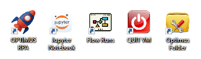

# Configuration

Instructions on configuring the software for first-time use.  

## Installation notes

- On first run of after installation, expect some running time to download and setup TagUI (~200MB) 

- When running "send email" command from rpa script, if below error is encountered, its probably because of some security policy that prevents programatic access to outlook. Enable programatic access to resolve the problem.

  

- To setup a good RPA environment on your workstation or VM, you can add the following shortcuts
    - optimus folder
    - jupyter notebook
    - Prefect dashboard
    - Quit VM

- Setup key windows task jobs for the optimus
    - optimus services - activates `prefect server`, `remote services`, `telegram server`
    - run daily reboot - good practice to reboot the RPA workstation on a daily basis

