# Getting Started  

## Installation

Step-by-step guide to installing OPTIMUS RPA.    

## Quick Start Guide  

A simple example to get users up and running quickly.  

### Demo of OPTIMUS RPA  

  

Here is a demo of OPTIMUS RPA completing the RPA challenge in under 10 seconds [demo video](https://www.youtube.com/watch?v=BWfCpwz76io)   
Action was defined by less than 10 steps of actions defined in following Excel script:  

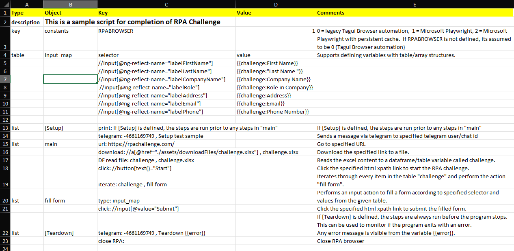

This Excel script demonstrates a few key features and versatility of the OPTIMUS automation language:  

1. **keyword-driven**: intuitive key words to perform various automation actions e.g. url (to go to specified url), click, download etc.  
2. **modular actions**: define your own complex blocks of action comprising of a list of automation steps e.g. fill form.  
3. **iteration and loops**: support more complex automation flows like performing a block of actions for every item in the table.  
4. **variables and tables**: rich user defined parameters to support complex automation flows.
5. **extensibility**:  combine OPTIMUS commands with Excel formulas and macros for more complex actions. Or extend OPTIMUS commands with user defined libraries.  

The automation language used by OPTIMUS is really **easy for beginners** to learn to develop your own flows.  But at the same time, it is rich enough to support sophisticated automation flows.  And has various modular constructs to support reuse and scalability for larger automation projects.  

## Usage

- Use `runRPA.bat` to launch RPA program.  Requires to specify an Excel script file.
- Example with Excel script file sample.xlsm :   >> `runRPA -f sample`  
- Sample script files "sample" available to test various RPA functionality
- All excel script files are to be placed in `\scripts`
    And they can include RPA images (for Visual automation of your desktop and websites)

- To launch the Prefect workflow engine, run startOrion.bat to launch the orion workflow server in background.
    - And open the [Prefect dashboard](http://127.0.0.1:4200) in your local browser
    - Refer to the documentation here for more details on [managing automation flows and deployments in the workflow dashboard](./docs/ORCHESTRATION.md).

## Documentation

### OPTIMUS Studio

OPTIMUS Studio is a GUI front end for operation of OPTIMUS RPA.  
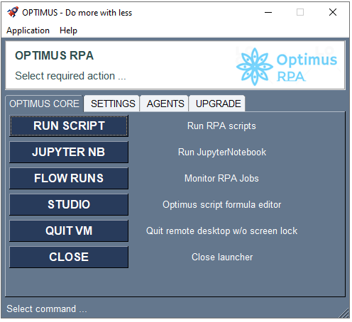  

Some of the cool features include:  

1. Run automation scripts - with support for interactive and record mode, that allows recording of automation steps.  
2. Recording - video of automation run.
3. Notifications - via Telegram.
4. Remote services - launch automation flows on your robot remotely via Telegram.
5. Quick Patch - to update OPTIMUS with latest functionality and release.  
Refer here for details on use of OPTIMUS Studio.  


# Quick Usage Guide
Assumes that your computer has already been installed and setup with Optimus.
Follow the usage guide below on how to use Optimus RPA.

## Navigating Optimus Program

### Optimus Program Folder

Optimus is installed by default to your root directory e.g. `D:\Optimus`  

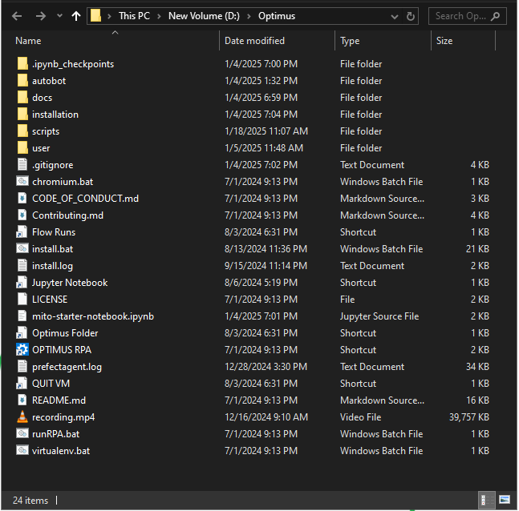

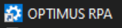 is used to launch the RPA program.  
Can also be called from command line by `runRPA.bat`.  

### Useful shortcuts

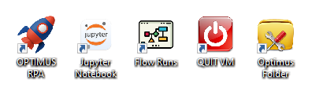

As a best practice, you can place shortcuts to frequently used Optimus programs on the desktop for easy access.  Here are some of the useful shortcuts for Optimus:  

- open `Optimus folder`  
- launch `Jupyter notebook`  
- launch `Prefect Orion dashboard` - which is used for monitor and manage your automation flows  
- `Quit VM` - to quit your current virtual machine session without logging off the computer. This is necessary if you are running Optimus on an "always on" computer.  
??? "Attention when using visual automation"

    If the computer is logged off, Optimus will not be able to launch the automations properly especially if the automation flow requires visual automation.


### Scripts Folder

Optimus automation scripts are created in Excel and do not require any programming skills.  
These scripts are stored in the `scripts` folder.  
A `rpa_challenge.xlsm` script is available in the `scripts` folder for you to learn how to write Optimus automation scripts.

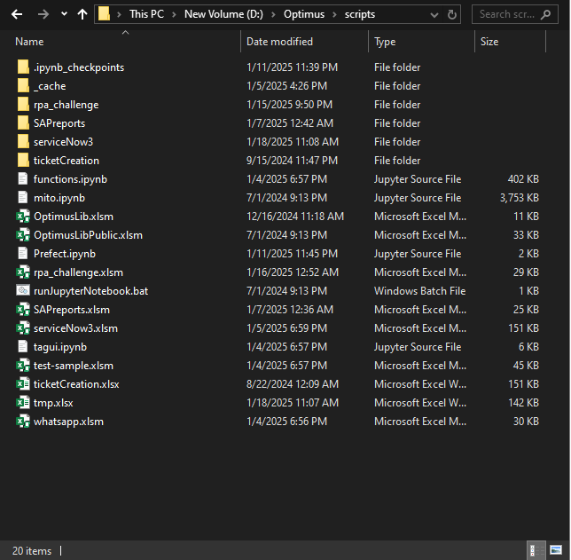

### How to run a RPA script

You can run the `rpa_challenge.xlsm` script from:  

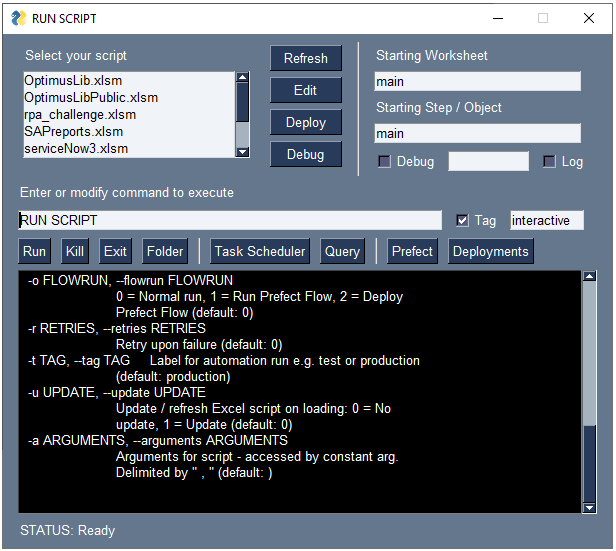

Or from the command line as follows: `runRPA -f rpa_challenge`  

For help on how to use runRPA utility: `runRPA -help` or `runRPA -h`

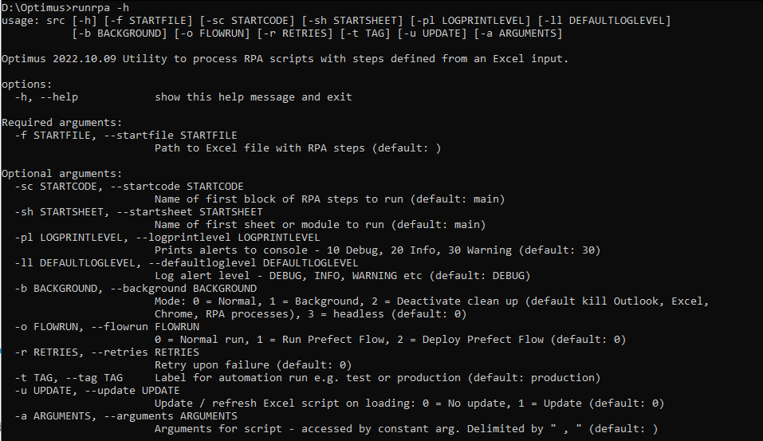

### Outputs from the execution of RPA script

Each step of the script that is executed is displayed in the output for reference.  

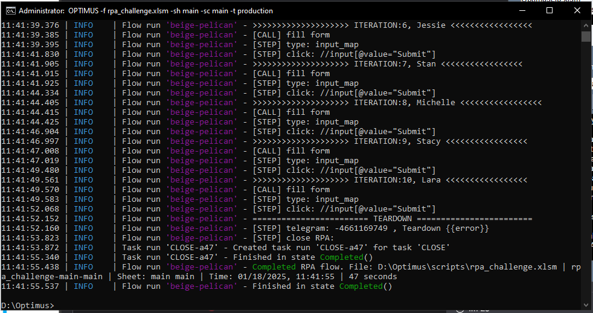  

!!! note "Additional DEBUG details"
    Can be shown in the output by activating `D:\Optimus\autobot\setLogLevelDEBUG.bat`  
    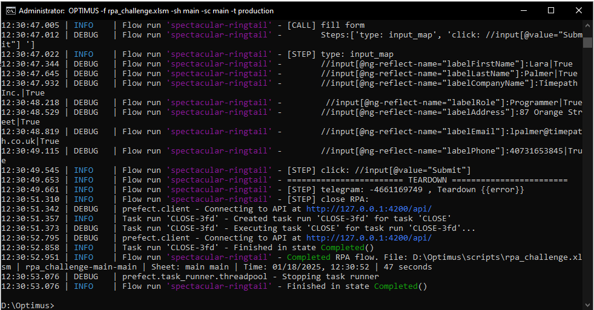

### Monitoring automation flows

All executed flows can be monitored in the `Prefect Server Dashboard`
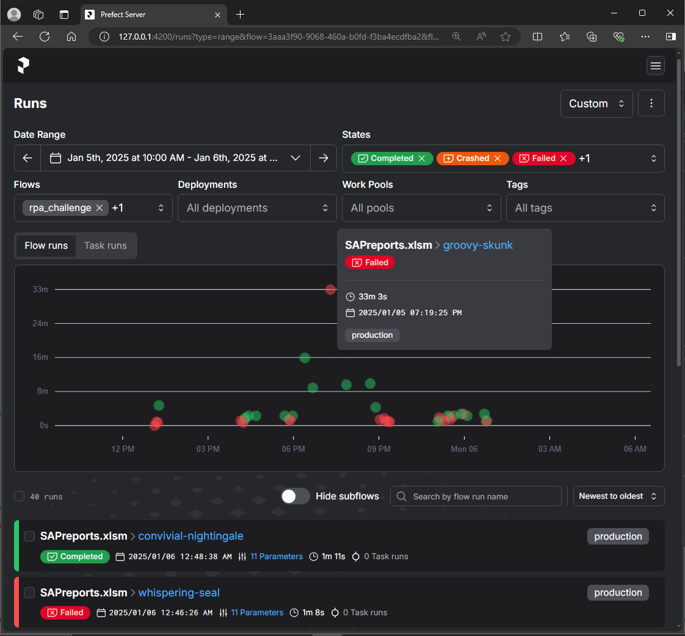

Details of the execution logs of each flow can be drilled down from the dashboard.
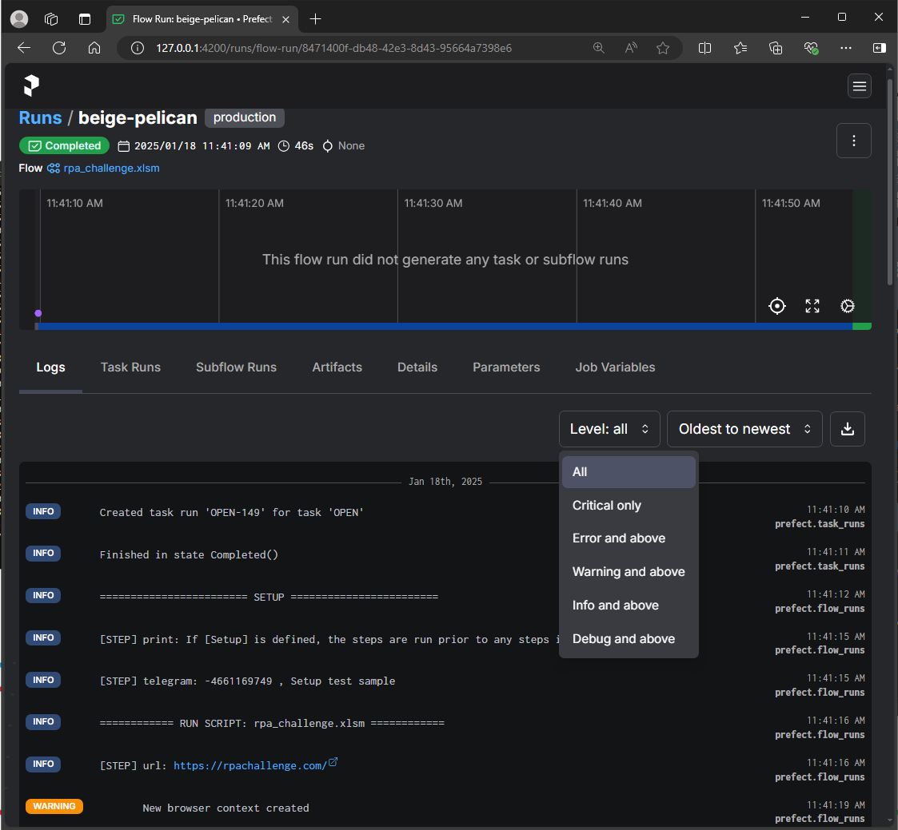

### Working with Jupyter Notebook

Juypter notebook can be launched from the shortcut.  
An example of how the jupyter notebook can be executed from the automation script is shown below:  

```
runJupyterNb: DataPreparationv3.ipynb , {"forceRun":"True","strSearch":"<strSearch>", "runDownload":"FALSE", "runJupyter":"FALSE", "generatedDateTime":"19/10/2023 14:01:16"}
```  

`runJupyterNb` is the keyword command.  
First parameter is the notebook file name.  
And the next parameter are the parameters to be passed to the notebook in JSON format e.g.  `{key1:value1, key2:value2}`  

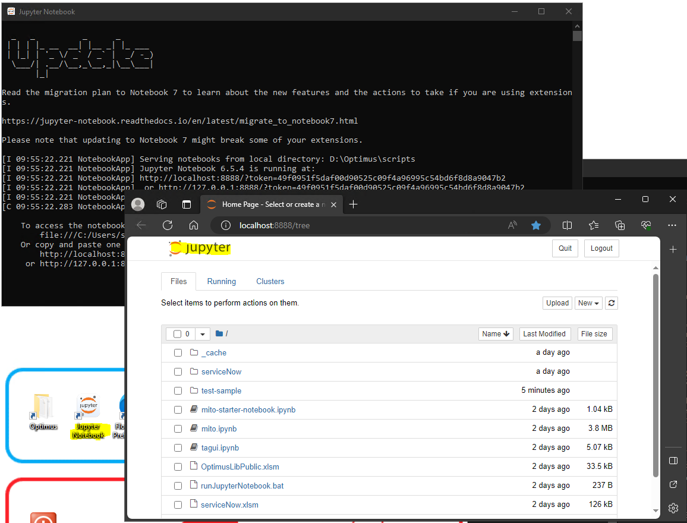

