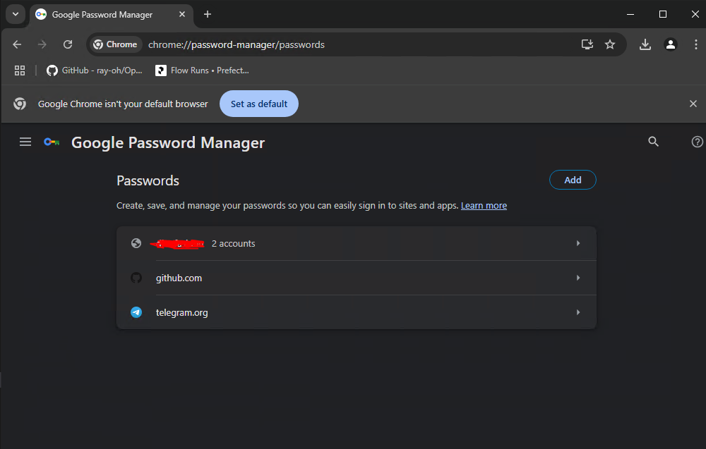
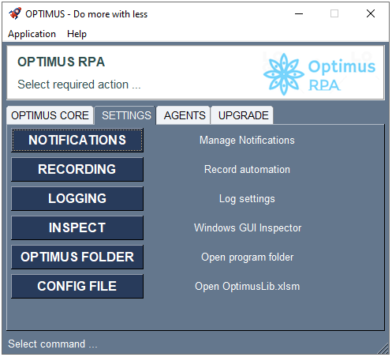
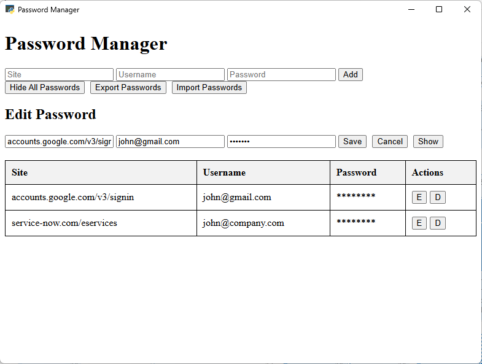

# Security

**How to manage passwords**  

OPTIMUS web automations rely on your local Chrome applications `Google Password Manager` to securely store passwords on your local computer, instead on in your scripts.

To access the Google Password Manager, open your Chrome browser and go to `chrome://password-manager/passwords`:  

**New Update - New Password Management**

Password management is now maintained directly from the Optimus application.  And not via `Google Password Manager`.

Access from Optimus Application - Settings:  

Password Manager screen:  

