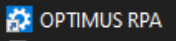

# Navigation

Navigating various functions in OPTIMUS via the launcher.

# OPTIMUS RPA Launcher
GUI for launching OPTIMUS.  And also settings management.  
Simplifies the management of command lines actions for users.  

  

Some key features:  

1. OPTIMUS CORE

    - `Run Script`: RUN/EDIT/DEPLOY automation script with debug, log, LIVE/interactive mode and other settings  
          
    - `Interactive mode`  
          
    - `OPTIMUS Command Builder`: Helps input of OPTIMUS keyword actions  
          
    - Jupyter Notebook  
    - `Studio`: Look up keywords and usage  
          
    - Quit VM  
    - Close

2. SETTINGS

    - `Notifications` - set TELEGRAM ID, activate/deactivate notifications
    - `Recording`  - activate/deactivate recording
    - Logging
    - `Debug Level` - activate DEBUG logging
    - `Info Level`  - activate INFO level logging
    - Inspect
    - Optimus folder

3. AGENTS

    - `Services`  - setup services for PREFECT orchestrator and agent
        >   
    - `Workflow`  - query and delete automation flow executions
          
    - `Task Scheduler`  - windows task scheduler to manage specific automation job flows
    - CMD
    - Clean
    - Notepad

4. UPGRADE

    - `Upgrade`   - upgrade current installation to latest version.  Download from github or take existing optimus_package_upgrade.zip in app directory.  
          
    - `Help`      - generate help file  
    - `Package`   - create packages for current DEV installation  
    - `Shortcut`  - create key shortcuts to desktop  
        >   
    - `Libraries` - launch CMD for virtual environment.  Allow `pip install` of additional libraries.  
        >   
