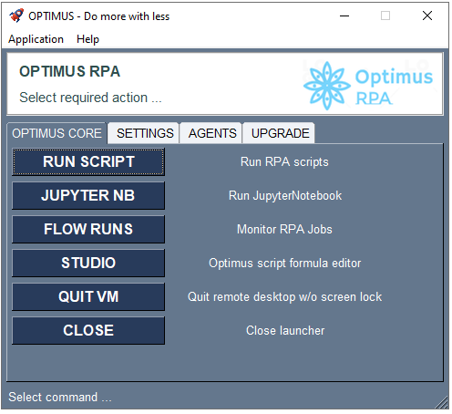
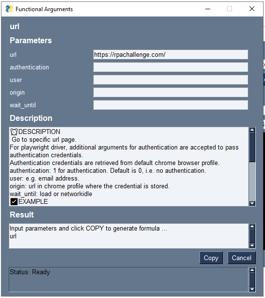
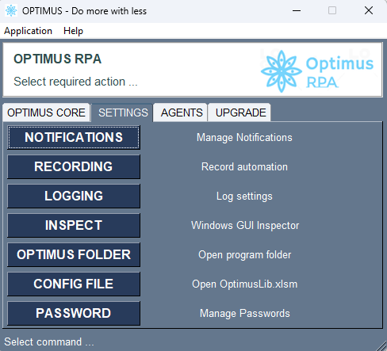

# Navigation

Navigating various functions in OPTIMUS via the launcher.

# OPTIMUS RPA Launcher
GUI for launching OPTIMUS.  And also settings management.  
Simplifies the management of command lines actions for users.  

Some key features:  

1. OPTIMUS CORE

      

    - `Run Script`: RUN/EDIT/DEPLOY automation script with debug, log, LIVE/interactive mode and other settings  
          

    - `Interactive mode`  
          

    - `OPTIMUS Command Builder`: Helps input of OPTIMUS keyword actions  
          

    - Jupyter Notebook

    - `Studio`: Look up keywords and usage  
          

    - Quit VM

    - Close

2. SETTINGS

      

    - `Notifications` - set TELEGRAM ID, activate/deactivate notifications

    - `Recording`  - activate/deactivate recording

    - `Logging`
        - `Debug Level` - activate DEBUG logging
        - `Info Level`  - activate INFO level logging

    - Inspect

    - Optimus folder

3. AGENTS

      

    - `Services`  - setup services for PREFECT orchestrator and agent
          

    - `Workflow`  - query and delete automation flow executions  
          

    - `Task Scheduler`  - opens windows task scheduler to manage specific automation job flows

4. UPGRADE

      

    - `Upgrade`   - upgrade current installation to latest version.  Download from github or take existing optimus_package_upgrade.zip in app directory.  
        

    - `Help`      - generate help file  

    - `Package`   - create packages for current DEV installation  

    - `Shortcut`  - create key shortcuts to desktop  
          

    - `Libraries` - launch CMD for virtual environment.  Allow `pip install` of additional libraries.  
          

## OPTIMUS RPA Studio

Application to help launch and edit scripts.  Also provides features like: recording, debugging, inspect browser locators.  

**Shortcut**:  

  

**Optimus RPA menu**:  

  
  
Using OPTIMUS RPA studio.  Typical steps:
- Select script
- Edit script
- Debug script
- Log - special beta logging
- Break - if word matches action
- Run script  

  
  
**Debug / Interactive Run mode**:  

  

**Record and Save**:  

  

- Record and Save - to insert and save new actions
- auto save - to automatically save created actions in new "Record" sheet in Excel  
- Other options:
  - Step - to next action
  - Continue - to next action that contains defined step
  - Terminate - run
  - Edit - script
  - Studio - launch help and builder for actions
  - Variables / Resolve - to inspect variable values  
  
**Studio - action builder / help**:  

  

### Determining selectors/locators

### Playwright Inspector - Pick locator

Use `pause:` to trigger pause and enable playwright inspector window  

  
Playwright Inspector and Pick locator:  
- Pick locator displays useful info on selector to use for selected elements in browser  

  

  

